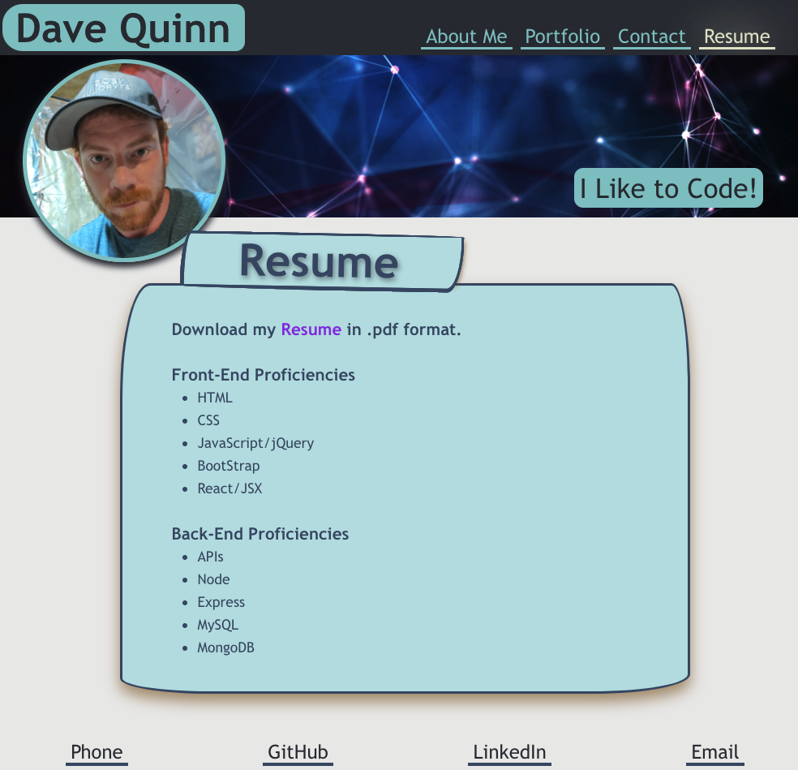
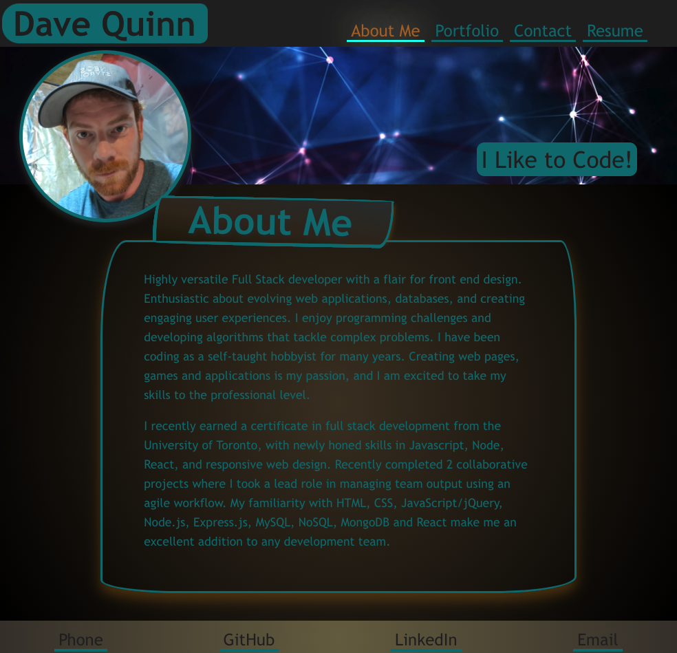

 # Development Portfolio
              

# Description

This is a [Web Page](https://en.wikipedia.org/wiki/Web_page) to showcase my development work. Comprised of coding and web dev projects to highlight my talents to prospective employers. It was designed using React as a single page web application.

[View the Site](https://qcent.github.io/) \
Screenshot of Lightmode: \


## Project Objectives
Design a polished and professional portfolio using React.js while relying on advanced CSS to accomplish site design and styling. I will also utilize media queries, flex-box and scaling elements to maintain a consistent look on all screen sizes. Support for Dark Mode will also be included with some alternate styling choices for the dim eyed among us.

I will also include many CSS animations and transitions to breathe some life and excitement into an otherwise perfectly fine looking website.


## Installation

Should load in all modern web browsers supporting HTML5 and CSS3 and JavaScript. However, it is recommended to view using [Google Chrome](https://www.google.com/intl/en_ca/chrome/)

## Usage

```
open https://qcent.github.io/

```
...or alternatively... \
Click this link https://qcent.github.io/ \
Once here:

move the mouse, click around, and read some things.

## Contributing
Pull requests are totally welcome. For major changes, please open an issue first to discuss what you would like to change. \
\* _Hint_ \* Only things that make me look good will be approved.

But please, please make sure to test as appropriate. I worked really hard on this, and you don't want to go and mess it up... Do You?


## License

MIT License

Copyright (c) 2022 Dave Quinn

Permission is hereby granted, free of charge, to any person obtaining a copy
of this software and associated documentation files (the "Software"), to deal
in the Software without restriction, including without limitation the rights
to use, copy, modify, merge, publish, distribute, sublicense, and/or sell
copies of the Software, and to permit persons to whom the Software is
furnished to do so, subject to the following conditions:

The above copyright notice and this permission notice shall be included in all
copies or substantial portions of the Software.

THE SOFTWARE IS PROVIDED "AS IS", WITHOUT WARRANTY OF ANY KIND, EXPRESS OR
IMPLIED, INCLUDING BUT NOT LIMITED TO THE WARRANTIES OF MERCHANTABILITY,
FITNESS FOR A PARTICULAR PURPOSE AND NONINFRINGEMENT. IN NO EVENT SHALL THE
AUTHORS OR COPYRIGHT HOLDERS BE LIABLE FOR ANY CLAIM, DAMAGES OR OTHER
LIABILITY, WHETHER IN AN ACTION OF CONTRACT, TORT OR OTHERWISE, ARISING FROM,
OUT OF OR IN CONNECTION WITH THE SOFTWARE OR THE USE OR OTHER DEALINGS IN THE
SOFTWARE.